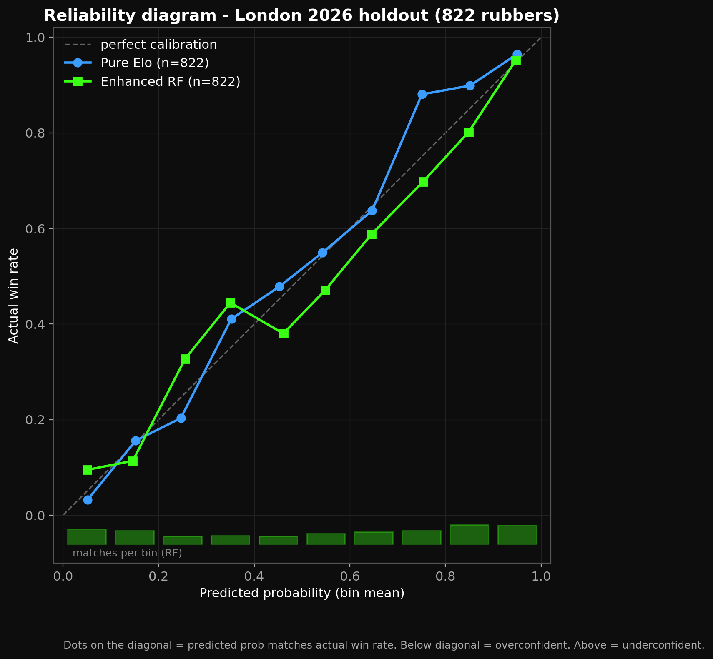

# topspin-lab

> **Leak-free Elo + ML forecasting for table tennis.**
> **70.3% walk-forward accuracy** on a 26-month rolling holdout, **75.1% on a frozen unseen tournament** (2026 World Team Table Tennis Championships in London, 822 singles rubbers).

[](LICENSE)
[](https://www.python.org/)



*Reliability diagram on the WTTC London 2026 holdout (World Team Table Tennis Championships, ITTF, April-May 2026). Dots near the diagonal = predicted probability matches reality. Both Pure Elo and the 9-feature RF track the diagonal across 10 deciles. Bottom bars show match counts per bin (heavier at the tails: the tournament had many lopsided rubbers).*

---

## The hook

I trained a model on every ITTF singles match I could find - **157,836 matches stretching back to 1988**. Then I froze it.

Six weeks later, the **2026 World Team Table Tennis Championships** started in London (ITTF flagship team event, April 28 - May 10, 2026). The model had never seen a single match from it. I asked it to predict all 822 singles rubbers.

It got **617 of them right.**

| Test | n | Accuracy | AUC | Brier | LogLoss |
|---|---:|---:|---:|---:|---:|
| **WTTC London 2026 - frozen unseen tournament** | 822 | **75.06%** | **0.8356** | 0.1666 | 0.5022 |
| 2024-2026 walk-forward (month-by-month refit) | ~21k | **70.26%** | **0.7794** | - | - |

Both numbers come from time-based splits with strict chronological processing. The **70.3% walk-forward is the steady-state expectation** across the full open-event distribution; the **75.1% WTTC London 2026 number** is one specific tournament the model never saw - elite-heavier than average, so easier to predict. Quote whichever fits your question. The full method is in [`docs/methodology.md`](docs/methodology.md).

---

## Why I built it

Most "AI predicts sports" results score on a re-split of the training distribution. The headline number is real but uninformative - the model has already statistically seen the test set. I wanted to see what a simple Elo + RF stack looks like when the holdout is an event that did not exist when the model was frozen.

Rules enforced in code:

- No look-ahead bias. Every feature at time `t` uses only data with timestamp `< t`. Treated as a correctness bug, not a performance issue.
- Time-based splits only. Never random splits on time-series.
- Every metric on this page regenerates from raw data + code. No `.pkl` artifacts committed.

---

## What the model sees

The whole pipeline is built around one rating system: **Elo**. Standard formulation, K=32, base 1500. Every match in chronological order updates two players' ratings.

That gives every player a trajectory. Here's Ma Long's, the most-rated player in our corpus:


White line is his full career. Green is his peak window: the top 20% of matches by smoothed Elo. The green dot is his career peak rating in our data, ~2600, about 1100 points above base. That's what "world-class" looks like to the model.

Now look at all 1,486 players with 50+ matches, with three stars overlaid:


Two things stand out. The cloud has a ceiling around 2400 that almost nobody crosses. The stars escape that ceiling along a similar shape: build from base Elo through ~100 matches, then climb. The model doesn't know the names. It just sees three players whose ratings keep going up.

---

## The test

The model was trained on every match up to **2026-03-16**. Frozen.

Then on **April 28**, the WTTC (World Team Table Tennis Championships) opened in London. The model was asked to predict every singles rubber. Two weeks and 822 predictions later:

[](experiments/london_2026_report.html)

> *Click the image to open the [full interactive HTML report](experiments/london_2026_report.html) - every match, every prediction, every actual outcome.*

75.1% accuracy. 0.836 AUC. 617 correct out of 822. Calibration sits on the diagonal - when the model says 80%, reality is ~80%. High-confidence (≥75%) predictions land at 85.9%.

---

## What surprised me

Pure Elo alone scores 73.97% on London 2026. No ML, no features, just rating difference. The 9-feature Random Forest adds one percentage point. Most of the table-tennis signal lives in a single number computed by 1960s arithmetic, and the ML stack is a small lift on top.

Inside that small lift, the opponent's recent form is about 2x more predictive than the player's own form (feature importance: `form_last_5_b` ~12% vs `form_last_5_a` ~6%). Reading: a player on a cold streak facing a strong opponent is a clearer signal than a player on a hot streak. Strong opponents punish weakness more reliably than they reward strength.

The model is also under-confident at the extremes. When it predicts 90%, reality is closer to 95%. Opposite of the usual failure mode, where models over-shout at the tails. Full reliability table in [`docs/results.md`](docs/results.md).

---

## Research observations

Things that came out of building this that aren't in the headline number:

- **Elo difference is ~59% of feature importance.** The next eight features fight over the remaining 41%. The model is mostly a fancy way to apply Elo with a couple of guardrails.
- **Form windows of 10 matches beat 5 and 7 days.** Shorter windows (5 matches) made form features noisier. The 7-day calendar window was almost always empty for most players outside major tournaments and got dropped from feature importance.
- **RF barely benefits from added features; LR benefits a lot.** Going from 5 baseline features (Elo + cumulative counts) to 9 enhanced features (Elo + form): LR gained +1.21% AUC, RF gained +0.06%. Reading: RF was already extracting the recent-form signal implicitly from cumulative counts; LR needed it spelled out.
- **The women's draw is more predictable than the men's.** WT acc 75.77%, MT acc 74.42%. WT has a wider talent spread, so similar-rating matchups are rarer.
- **Upsets cluster around layoffs and cold-start players.** ~12% of high-confidence predictions miss when one player has had a long inactive stretch (their stale Elo overestimates them). 4.1% of London matches involved a player with zero prior history — excluded from headline metric.

---

## Failed experiments

Not everything that was tried made it to the headline:

- **Per-event-tier K-factor.** Tried `K=24` for opens, `K=40` for majors. Walk-forward AUC moved by <0.001. Cut.
- **Head-to-head as a feature.** Most player pairs in the corpus meet 0 or 1 times — sparse and high-variance. Adding `h2h_win_rate_a_over_b` lifted training AUC and hurt holdout. Cut. Listed as a "maybe" in `docs/methodology.md` for someone with a richer h2h dataset.
- **Form window = 5 matches.** Strictly worse than 10. Noisy at the tails. Kept the 5-match feature alongside 10-match because tree models did extract some marginal signal from the combination — but the 5-match alone was useless.
- **Aggressive recency weighting on Elo.** Doubling K for the last 90 days made hot players over-rated and cold players under-rated. Walk-forward stability collapsed in months following major tournaments. Reverted to flat K=32.
- **The 7-day calendar form window.** Mean predictive value barely above zero. Most matches outside Grand Smashes have no entries in the prior week. Kept in the feature set for diagnostic purposes only — feature importance is in the noise.

If you have ideas that look obvious and are missing here, they probably were tried and silently dropped. The unstructured working notes live in [`docs/notes/research-log.md`](docs/notes/research-log.md) and an open punch list is at [`docs/notes/TODO.md`](docs/notes/TODO.md).

---

## Reproduce it

```bash
git clone https://github.com/Roni-quant/topspin-lab.git
cd topspin-lab
python -m venv .venv && source .venv/bin/activate   # Windows: .venv\Scripts\activate
pip install -r requirements.txt
cp .env.example .env    # fill in ITTF credentials (Windows: `copy`)
```

One command runs the whole thing:

```bash
python scripts/reproduce_london.py
```

It scrapes, cleans, computes Elo, builds features, trains the RF, scores London 2026, writes the HTML report, and regenerates plots. 30 to 90 minutes depending on ITTF API speed and your CPU.

Resume from partial state with flags:

```bash
python scripts/reproduce_london.py --skip-scrape     # data/raw/* already present
python scripts/reproduce_london.py --only-validate   # model + features already built
python scripts/reproduce_london.py --no-plots        # skip viz at the end
```

Or run individual stages manually, in the same order: `pipeline.fetch_events` -> `pipeline.fetch_matches` -> `pipeline.merge_raw` -> `pipeline.clean` -> `pipeline.compute_elo` -> `pipeline.generate_features_v2` -> `experiments.retrain_enhanced_rf` -> `experiments.fetch_london_2026` -> `experiments.validate_london_2026` -> `experiments.build_london_report` -> `viz.make_all`. Each is `python -m <module>`. When the run finishes, open `experiments/london_2026_report.html`.

---

## How it works (60 seconds)

```
ITTF API   →  raw_matches  →  clean  →  Elo ratings  →  features  →  RF model
(scrape)      (Parquet)       (dedupe)  (sequential)    (form + Elo)  (predict)
```

Each stage is a separate Python module under `pipeline/`, reads Parquet, writes Parquet, and is idempotent.

### The Elo update

Two equations, applied after every match. Both players start at $R = 1500$.

**Expected score for A:**

$$E_A = \frac{1}{1 + 10^{(R_B - R_A)/400}}$$

**Rating update after the match:**

$$R_A' = R_A + K \cdot (S_A - E_A)$$

$S_A$ is the actual outcome (1 if A won, 0 if A lost). $K = 32$ controls how fast ratings move. If A beats a much stronger B, $S_A - E_A$ is large and positive: A gains a lot. If A beats a weaker B, the gain is small (the win was expected). Same logic in reverse for B. No batch refit. Pre-match ratings are captured before the update, so features at time $t$ only ever see ratings derived from matches at time $< t$.

Implemented in ~60 lines at [`ratings/elo.py`](ratings/elo.py). The Random Forest sits on top with 9 features:

| Feature | What it measures |
|---|---|
| `elo_difference` | Pre-match rating gap (signed: A − B) |
| `form_last_5_a/b`, `form_last_10_a/b` | Win rate over the most recent 5/10 matches |
| `form_7_days_a/b` | Win rate over the last 7 calendar days |
| `matches_last_7_a/b` | Match count over the last 7 days (workload) |

All features computed by walking each player's history forward. A player's first match has form features as `NaN` (filled with 0 at training time - explicit, not silent imputation). No random shuffling anywhere.

---

## Repository structure

```
topspin-lab/
├── pipeline/         # Numbered stages: fetch → clean → elo → features → train
├── ratings/          # Sequential Elo engine
├── experiments/      # London 2026 validation, retraining, HTML report
├── viz/              # Plot generators (writes docs/img/*.png)
├── docs/             # methodology.md, results.md, generated images
└── data/, models/    # Local artifacts (not committed - regenerate)
```

---

## Why this is not a Kaggle toy

| Concern | How it's handled |
|---|---|
| Look-ahead bias | Strict chronological processing; pre-match Elo captured before update; features use only past entries |
| Random vs time splits | Time-based splits at the calendar-year boundary; walk-forward validation in `pipeline/forward_test.py` |
| Cold-start players | Excluded from the headline metric (35 / 857 in London 2026); reported separately |
| Doubles vs singles | Doubles filtered at scrape time; Elo on individuals only |
| Calibration | Reliability tables in `docs/results.md`; mid-range well-calibrated, slight under-confidence at extremes |
| Reproducibility | Model artifact is *not* committed - `experiments/retrain_enhanced_rf.py` rebuilds it from features |
| Supply-chain hygiene | No `.pkl` in the repo; users regenerate locally. See `CONTRIBUTING.md`. |

---

## Known limitations

- No surface / equipment / ball-type modeling.
- K-factor not tuned by event tier.
- No team-rubber order modeling (in team formats, match order is a strategic choice).
- One tournament is one tournament - the 75% headline has a ~3% Wilson interval (treat it as "between 72% and 78%").

Full list in [`docs/methodology.md`](docs/methodology.md).

---

## Scope and intent

Research and educational project. No odds-API integration, no staking logic, no money flow. Predicted probabilities are model outputs, not signals to act on. Not affiliated with the ITTF or any bookmaker. Use it to study the methodology, reproduce the numbers, or extend the model.

---

## Going deeper

- [`docs/methodology.md`](docs/methodology.md) - design decisions, leakage discipline, why Elo, walk-forward validation, cold-start handling
- [`docs/results.md`](docs/results.md) - full metrics, calibration tables, per-category breakdown, feature importance, comparison to published baselines
- [`docs/notes/research-log.md`](docs/notes/research-log.md) - unpolished working notes; what was tried, what broke, what was cut
- [`docs/notes/TODO.md`](docs/notes/TODO.md) - open punch list
- [`experiments/london_2026_report.html`](experiments/london_2026_report.html) - every prediction in the holdout tournament, sortable / filterable
- [`CONTRIBUTING.md`](CONTRIBUTING.md) - ground rules for PRs

## License

MIT - see [`LICENSE`](LICENSE).

## Acknowledgments

Data scraped from the [ITTF results portal](https://results.ittf.link/). This project is not affiliated with or endorsed by the ITTF.
