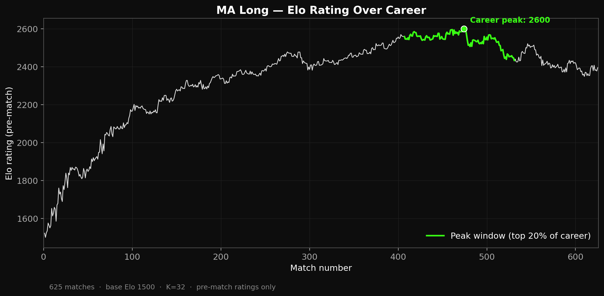
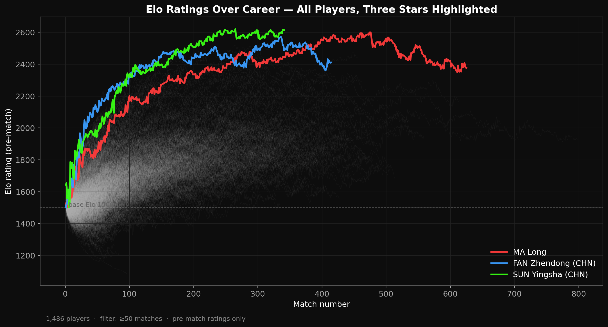
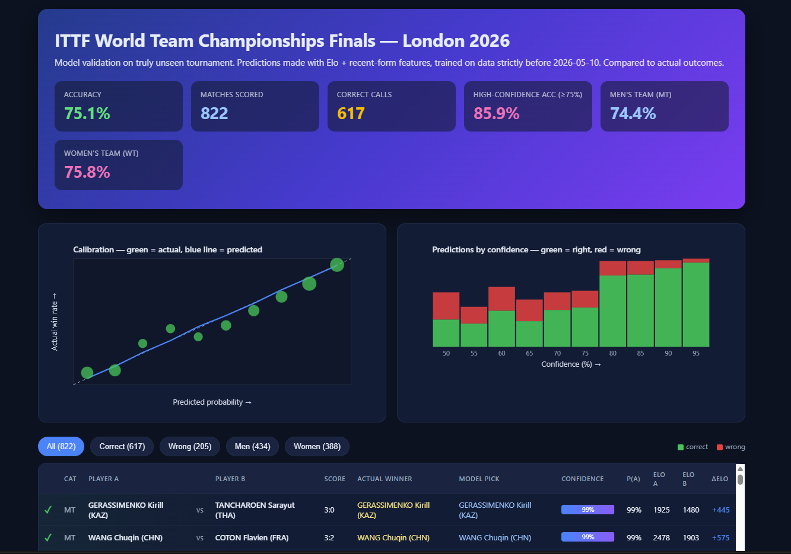

# topspin-lab

> **Leak-free Elo + ML forecasting for table tennis.**
> **70.3% walk-forward accuracy** on a 26-month rolling holdout, **75.1% on a frozen unseen tournament** (ITTF World Team Championships London 2026, 822 singles rubbers).

[](LICENSE)
[](https://www.python.org/)

---

## The hook

I trained a model on every ITTF singles match I could find - **157,836 matches stretching back to 1988**. Then I froze it.

Six weeks later, the ITTF World Team Championships started in London. The model had never seen a single match from it. I asked it to predict all 822 singles rubbers.

It got **617 of them right.**

| Test | n | Accuracy | AUC | Brier | LogLoss |
|---|---:|---:|---:|---:|---:|
| **London 2026 - frozen unseen tournament** | 822 | **75.06%** | **0.8356** | 0.1666 | 0.5022 |
| 2024–2026 walk-forward (month-by-month refit) | ~21k | **70.26%** | **0.7794** | - | - |

Both numbers come from time-based splits with strict chronological processing. The **70.3% walk-forward is the steady-state expectation** across the full open-event distribution; the **75.1% London number** is one specific tournament the model never saw - elite-heavier than average, so easier to predict. Quote whichever fits your question. The full method is in [`docs/methodology.md`](docs/methodology.md).

---

## Why I built it

Most "AI predicts sports" results score on a re-split of the training distribution. The headline number is real but uninformative - the model has already statistically seen the test set. I wanted to see what a simple Elo + RF stack looks like when the holdout is an event that did not exist when the model was frozen.

Three rules the codebase enforces:

1. **No look-ahead bias.** Every feature at time `t` uses only data with timestamp `< t`. Treated as a correctness bug, not a performance issue.
2. **Time-based splits only.** Never random splits on time-series data.
3. **Reproducibility.** Every metric on this page regenerates from raw data + code. No `.pkl` artifacts committed.

---

## What the model sees

The whole pipeline is built around one rating system: **Elo**. Standard formulation, K=32, base 1500. Every match in chronological order updates two players' ratings.

That gives every player a trajectory. Here's Ma Long's, the most-rated player in our corpus:



White line is his full career. Green is his peak window - the top 20% of matches by smoothed Elo. The green dot is his career peak rating in our data: **~2600**, roughly 1100 points above a base-rate player. That is what "world-class" looks like to the model.

Now look at all 1,486 players with 50+ matches, with three stars overlaid:



Two things to notice. **First**, the cloud has a ceiling - almost nobody crosses ~2400. **Second**, the stars escape that ceiling on a remarkably consistent trajectory: each builds from base Elo through their first ~100 matches, then climbs. The model doesn't know the names. It just sees three players whose ratings keep going up.

---

## The test

The model was trained on every match up to **2026-03-16**. Frozen.

Then on **April 28**, the ITTF World Team Championships London 2026 started. The model was asked to predict every singles rubber. Two weeks and 822 predictions later:

[](experiments/london_2026_report.html)

> *Click the image to open the [full interactive HTML report](experiments/london_2026_report.html) - every match, every prediction, every actual outcome.*

75.1% accuracy. 0.836 AUC. 617 correct out of 822. Calibration sits on the diagonal - when the model says 80%, reality is ~80%. High-confidence (≥75%) predictions land at 85.9%.

---

## What surprised me

Three findings I didn't expect:

1. **Pure Elo alone gets 73.97%.** No ML, no features. Just rating difference. The Random Forest adds *one percentage point*. Most of the signal in table tennis lives in a single number computed by 1960s arithmetic.

2. **Opponent's recent form is ~2× more predictive than the player's own.** A player on a cold streak entering a match against a strong opponent is a clearer signal than a player on a hot streak. Strong opponents punish weakness more reliably than they reward strength.

3. **The 9-feature model is well-calibrated mid-range but under-confident at the extremes.** When it says 90%, reality is 95%. This is the opposite failure mode from most ML models, which over-confidently shout 90% when reality is 75%.

If a 9-feature RF is one point better than rating-difference alone, that *is* the result. The Elo baseline is the bar - and the bar is already high.

---

## Reproduce it

```bash
git clone https://github.com/Roni-quant/topspin-lab.git
cd topspin-lab
python -m venv .venv && source .venv/bin/activate   # Windows: .venv\Scripts\activate
pip install -r requirements.txt
cp .env.example .env    # fill in ITTF credentials (Windows: `copy`)
```

One command runs the whole thing:

```bash
python scripts/reproduce_london.py
```

It scrapes, cleans, computes Elo, builds features, trains the RF, scores London 2026, writes the HTML report, and regenerates plots. Roughly 30 to 90 minutes depending on ITTF API speed and your CPU.

Resume from partial state with flags:

```bash
python scripts/reproduce_london.py --skip-scrape     # data/raw/* already present
python scripts/reproduce_london.py --only-validate   # model + features already built
python scripts/reproduce_london.py --no-plots        # skip viz at the end
```

Or run individual stages manually, in the same order: `pipeline.fetch_events` -> `pipeline.fetch_matches` -> `pipeline.merge_raw` -> `pipeline.clean` -> `pipeline.compute_elo` -> `pipeline.generate_features_v2` -> `experiments.retrain_enhanced_rf` -> `experiments.fetch_london_2026` -> `experiments.validate_london_2026` -> `experiments.build_london_report` -> `viz.make_all`. Each is `python -m <module>`. When the run finishes, open `experiments/london_2026_report.html`.

---

## How it works (60 seconds)

```
ITTF API   →  raw_matches  →  clean  →  Elo ratings  →  features  →  RF model
(scrape)      (Parquet)       (dedupe)  (sequential)    (form + Elo)  (predict)
```

Each stage is a separate Python module under `pipeline/`, reads Parquet, writes Parquet, and is idempotent. The Elo engine (`ratings/elo.py`) is plain Python - standard K=32, base 1500. The Random Forest uses 9 features:

| Feature | What it measures |
|---|---|
| `elo_difference` | Pre-match rating gap (signed: A − B) |
| `form_last_5_a/b`, `form_last_10_a/b` | Win rate over the most recent 5/10 matches |
| `form_7_days_a/b` | Win rate over the last 7 calendar days |
| `matches_last_7_a/b` | Match count over the last 7 days (workload) |

All features computed by walking each player's history forward. A player's first match has form features as `NaN` (filled with 0 at training time - explicit, not silent imputation). No random shuffling anywhere.

---

## Repository structure

```
topspin-lab/
├── pipeline/         # Numbered stages: fetch → clean → elo → features → train
├── ratings/          # Sequential Elo engine
├── experiments/      # London 2026 validation, retraining, HTML report
├── viz/              # Plot generators (writes docs/img/*.png)
├── docs/             # methodology.md, results.md, generated images
└── data/, models/    # Local artifacts (not committed - regenerate)
```

---

## Why this is not a Kaggle toy

| Concern | How it's handled |
|---|---|
| Look-ahead bias | Strict chronological processing; pre-match Elo captured before update; features use only past entries |
| Random vs time splits | Time-based splits at the calendar-year boundary; walk-forward validation in `pipeline/forward_test.py` |
| Cold-start players | Excluded from the headline metric (35 / 857 in London 2026); reported separately |
| Doubles vs singles | Doubles filtered at scrape time; Elo on individuals only |
| Calibration | Reliability tables in `docs/results.md`; mid-range well-calibrated, slight under-confidence at extremes |
| Reproducibility | Model artifact is *not* committed - `experiments/retrain_enhanced_rf.py` rebuilds it from features |
| Supply-chain hygiene | No `.pkl` in the repo; users regenerate locally. See `CONTRIBUTING.md`. |

---

## Known limitations

- No surface / equipment / ball-type modeling.
- K-factor not tuned by event tier.
- No team-rubber order modeling (in team formats, match order is a strategic choice).
- One tournament is one tournament - the 75% headline has a ~3% Wilson interval (treat it as "between 72% and 78%").

Full list in [`docs/methodology.md`](docs/methodology.md).

---

## Scope and intent

This repository is a **research and educational project**. It demonstrates a clean, leakage-free Elo + ML pipeline for predicting table-tennis outcomes and reports honest out-of-sample numbers. It is:

- **Not** a betting tool. There is no odds-API integration, no staking logic, no money flow.
- **Not** financial advice. Predicted probabilities are model outputs, not signals to act on.
- **Not** affiliated with the ITTF or any bookmaker.

Use it to study the methodology, reproduce the numbers, or extend the model.

---

## Going deeper

- [`docs/methodology.md`](docs/methodology.md) - design decisions, leakage discipline, why Elo, walk-forward validation, cold-start handling
- [`docs/results.md`](docs/results.md) - full metrics, calibration tables, per-category breakdown, feature importance, comparison to published baselines
- [`experiments/london_2026_report.html`](experiments/london_2026_report.html) - every prediction in the holdout tournament, sortable / filterable
- [`CONTRIBUTING.md`](CONTRIBUTING.md) - ground rules for PRs

## License

MIT - see [`LICENSE`](LICENSE).

## Acknowledgments

Data scraped from the [ITTF results portal](https://results.ittf.link/). This project is not affiliated with or endorsed by the ITTF.
